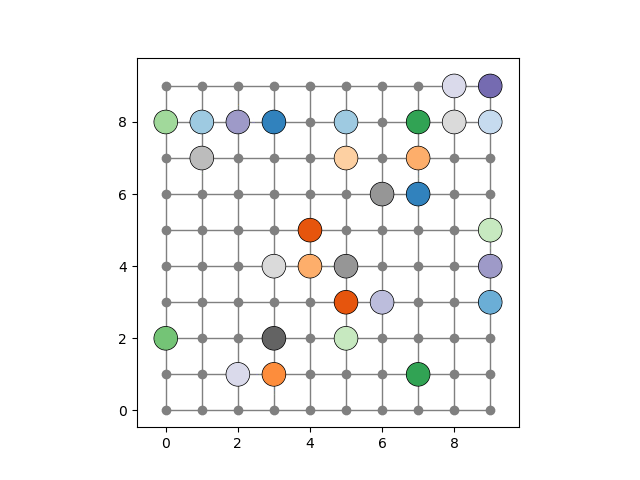

# Playground: Multi-Agent Motion Planning using Mathematical Optimization

> This is a playground for exploring options for multi-agent motion planning using mathematical optimization.
> It contains a set of prototypes for different approaches, only meant for experimentation and demonstration.
> The primary purpose of this repository is to share it with other researchers and students.
> Do not expect any of the code to be production-ready or even properly documented: 
> Many prototypes have been developed in a single afternoon, just to try out an idea.
> This work has primarily been conducted during my stay at Danny Halperin's lab at Tel Aviv University in 2022/2023.

## Problem Description

The problem of multi-agent motion planning is to find a collision-free trajectory for a set of agents in a shared workspace.
The workspace is represented by a grid graph, where each node represents potential collision-free positions for an agent.
In every time step, each agent can move to one of the neighboring nodes.
No two agents can occupy the same node at the same time, and no two agents can move on the same edge at the same time.
The goal is to find a trajectory for each agent with minimal movement such that no two agents collide with each other.

## Requirements

The following requirements are needed to run the code in this repository:

- Python 3.8 or higher
- Gurobi 10.0.0 or higher
- Matplotlib 3.5.0 or higher
- NetworkX 2.6.3 or higher
- JupyterLab 3.5.0 or higher

## Approaches

The following approaches are implemented in this repository:

* [01_exact_simple_mip.ipynb](./01_exact_simple_mip.ipynb) Simple exact solver based on the time-expanded graph using Gurobi and some basic graph reduction. Can solve instances in a 10x10 grid and 30 agents (30% density) to optimality in reasonable time. This essentially reproduces the results of [Yu and LaValle](https://ieeexplore.ieee.org/document/7539623). Developed 2022-11-27.
* [02_fixed_paths_mip.ipynb](./02_fixed_paths_mip.ipynb) Simple MIP for moving agents along fixed paths (waiting is allowed, turning back is not). If one just takes random shortest paths, this approach gets infeasible already for surprisingly low densities below 30% because of unresolvable conflicts. This MIP can also be modified to minimize the conflicts such that one only replaces the conflicting paths. Without any additional ideas, this approach is rather disappointing. Developed 2022-11-28.
* [03_flowsteps.ipynb](./03_flowsteps.ipynb) Split the problem into subproblems of limited time horizon.Of course, you won't be able to move all agents from their source to the target within a (very) limited time horizon (of maybe 8 steps). Thus, you need to find intermediate targets. Implementation of Yu and LaValle uses fixed targets for every agent. However, we can also use dynamic intermediate targets and just maximize the sum of intermediate target ratings. Having then a set of feasible intermediate targets, we can optimize for any objective function we like.
    Challenges: Rating intermediate agent positions. Trivial idea could be the remaining distance to the target.
    Can solve dense instance of 60% in a 10x10 grid or less dense instances in larger grids. Could be used within another solver as soon as some dense knots appear, to resolve them. Developed 2022-12-01
* [04_conflict_counter.ipynb](./04_conflict_counter.ipynb) A MIP-based solver that gets a number of agents to their goal on an optimal way,  respecting already planned paths. The most trivial version of this is one agent after another, but it seems like that doing this for 10 agents at the same time on 20x20 is no big deal and drastically reduces the conflicts (increases the solution quality). Does not always work, some CDS may be necessary. Developed 2022-12-05
* [05_conflict_minimization.ipynb](./05_conflict_minimization.ipynb) The idea of this approach is to start with a superoptimal solution and minimize the conflicts (intersections of paths) by selecting a small number k of paths that have many conflicts among each other and then finding new paths for these agents where the k new paths are not allowed to have conflicts while conflicts with the remaining paths are allowed but punished or limited.
This approach is suboptimal, but can be made optimal when used just as node improvement for CDS. This is a Large Neighborhood Search (LNS) approach.
Works nice for low densities. Not so great for higher densities. Has a lot of opportunities for fine tuning, but a considerable amount of work has to put in to increase  scalability.
Developed 2023-01-03.
* [06_conflict_minimization_iterative.ipynb](./06_conflict_minimization_iterative.ipynb) Further idea of iteratively adding an agent and allowing some intersections,  afterwards fixing those (which failed because often running into infeasibility) We iteratively add paths to the solution. The solution remaings feasible all the time. The special thing is that we compute the path in two iterations and may change previous paths. The first iterations  allows a limited number of conflicts. In  the second iteration we replan the path with all the conflicting paths. Developed 2023-01-04.

